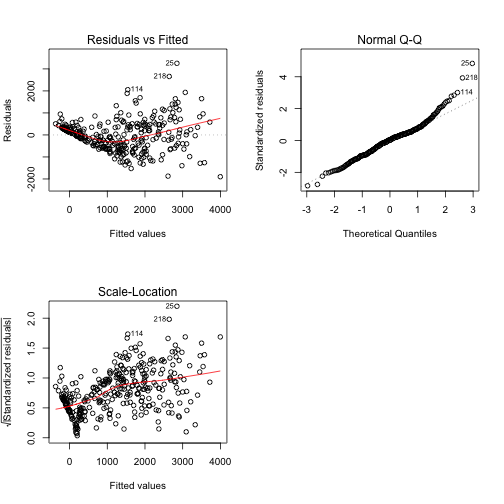

# Exercise 1

```r
library(MASS)
library(plyr)
library(MLmetrics)
library(leaps)
library(knitr)
baseball <-read.csv("baseball.txt",header=TRUE)
varnames <-names(baseball)[-1]
response <-names(baseball)[1]
unicef.full.model <-as.formula(paste(response,"~",paste(varnames,collapse=" + ")))
fullmod=lm(unicef.full.model,data = baseball)
empty <-lm(baseball$y~1,data=baseball)
backward=step(fullmod,direction="backward", data=unicef,trace=0)
forward=step(empty,direction="forward",scope=unicef.full.model, data=unicef,trace = 0)

best=lm(y ~ x3 + x7 + x8 + x10 + x11 + x12 + x13 + x14 + x15, data=baseball)
summary(best)
```

```
## 
## Call:
## lm(formula = y ~ x3 + x7 + x8 + x10 + x11 + x12 + x13 + x14 + 
##     x15, data = baseball)
## 
## Residuals:
##     Min      1Q  Median      3Q     Max 
## -1897.9  -460.6    18.3   346.9  3252.8 
## 
## Coefficients:
##             Estimate Std. Error t value Pr(>|t|)    
## (Intercept) -111.046     89.033  -1.247   0.2132    
## x3             5.782      3.224   1.794   0.0738 .  
## x7            24.026      9.762   2.461   0.0144 *  
## x8            16.031      3.820   4.196 3.50e-05 ***
## x10           -9.338      1.881  -4.964 1.11e-06 ***
## x11           11.516      4.507   2.555   0.0111 *  
## x12          -10.110      7.239  -1.397   0.1635    
## x13         1363.764    104.209  13.087  < 2e-16 ***
## x14         -276.567    136.902  -2.020   0.0442 *  
## x15          819.485    111.805   7.330 1.82e-12 ***
## ---
## Signif. codes:  0 '***' 0.001 '**' 0.01 '*' 0.05 '.' 0.1 ' ' 1
## 
## Residual standard error: 693.3 on 327 degrees of freedom
## Multiple R-squared:  0.6958,	Adjusted R-squared:  0.6874 
## F-statistic:  83.1 on 9 and 327 DF,  p-value: < 2.2e-16
```
Both backward and forward selection agree on choosing the followig model as best one: y ~ x3 + x7 + x8 + x10 + x11 + x12 + x13 + x14 + x15
The results in terms of adjusted R-squared are convincing, an high proportion of the variance of the dependent variable is explained by the model. Most of the coefficiets related to the variables are significant for an $\alpha=0.05$, but two of them are not, nevertheless are kept on the model anyway.


```r
par(mfrow=c(2,2))
plot(best,1)
plot(best,2)
plot(best,3)
```



The scale-loatio plot highlights a pattern between the two variables, so we are in the case of heteroschedasticity. We can solve this problem exploiting the Box-Cox transformation.


```r
box_cox <- boxcox(best, lambda = seq(-1,1, by=.1), main = "Box-Cox Power Transformation")
```


The graph suggests a value for $\lambda$ equal to 0, so we have to apply to $y$ a logarithmic trasformation


```r
best_log=lm(log(y) ~ x3 + x7 + x8 + x10 + x11 + x12 + x13 + x14 + x15, data=baseball)
plot(best_log,3)
```


Now the heteroschedasticity problem seem to be solved


```r
n=337
yhat <- numeric(0)
yhat_log= numeric(0)
for (i in 1:n){
  bs <- lm(y ~ x3 + x7 + x8 + x10 + x11 + x12 + x13 + x14 + x15, data=baseball[-i,])
  yhat[i] <- predict(bs,baseball[i,])
  bs_log=lm(log(y) ~ x3 + x7 + x8 + x10 + x11 + x12 + x13 + x14 + x15, data=baseball[-i,])
  mse=sum(bs_log$residuals^2)/bs_log$df.residual
  yhat_log[i] <- exp(predict(bs_log,baseball[i,]))*exp(mse*0.5)
  
}
sqloss <- sqrt(mean((yhat-baseball$y)^2))
sqloss_log <- sqrt(mean((yhat_log-baseball$y)^2))

trial <-matrix(c(sqloss,sqloss_log), ncol=2,nrow = 1)
colnames(trial) <-c("y","log(y)")
rownames(trial) <-c("sqlossfunction")
kable(trial)
```


|               |        y|   log(y)|
|:--------------|--------:|--------:|
|sqlossfunction | 711.9639| 724.9453|

# Exercise 2

```r
P=16
n=337
bestsub <- regsubsets(unicef.full.model,data=baseball,nvmax=16,method="exhaustive")
sbest <- summary(bestsub)

sqrlossbest_LOO <- numeric(0)
yhat_LOO <- matrix(NA,nrow=P,ncol=n)
modfor <- list()

for (j in 1:P){
  modfor[[j]] <-as.formula(paste(response,"~",paste(varnames[sbest$which[j,2:(P+1)]],
                                                    collapse=" + ")))
}
for (j in 1:P){
  for (i in 1:n){
    fmi <- lm(modfor[[j]], data=baseball[-i,])
    yhat_LOO[j,i] <- predict(fmi,baseball[i,])
  }
  sqrlossbest_LOO[j] <- sqrt(mean((yhat_LOO[j,]-baseball$y)^2))
}


###10-fold

#random shuffle data
baseball_shuff<-baseball[sample(nrow(baseball)),]

#Create 10 equally size folds
indexes <- cut(seq(1,nrow(baseball_shuff)),breaks=10,labels=FALSE)
Indexes=list()
for(i in 1:10){
  Indexes[[i]] <- which(indexes==i,arr.ind=TRUE)
  
}


sqrlossbest_10F <- numeric(0)
yhat_10F <- matrix(NA,nrow=P,ncol=n)
for (j in 1:P){
  for (i in 1:10){
    fmi <- lm(modfor[[j]], data=baseball_shuff[-Indexes[[i]],])
    yhat_10F[j,Indexes[[i]]] <- predict(fmi,baseball_shuff[Indexes[[i]],])
  }
  sqrlossbest_10F[j] <- sqrt(mean((yhat_10F[j,]-baseball_shuff$y)^2))
}


#5 Fold cv
baseball_shuff<-baseball[sample(nrow(baseball)),]

#Create 10 equally size folds
indexes <- cut(seq(1,nrow(baseball_shuff)),breaks=5,labels=FALSE)
Indexes=list()
for(i in 1:5){
  Indexes[[i]] <- which(indexes==i,arr.ind=TRUE)
  
}


sqrlossbest_5F <- numeric(0)
yhat_5F <- matrix(NA,nrow=P,ncol=n)
for (j in 1:P){
  for (i in 1:5){
    fmi <- lm(modfor[[j]], data=baseball_shuff[-Indexes[[i]],])
    yhat_5F[j,Indexes[[i]]] <- predict(fmi,baseball_shuff[Indexes[[i]],])
  }
  sqrlossbest_5F[j] <- sqrt(mean((yhat_5F[j,]-baseball_shuff$y)^2))
}

trial <-matrix(round(c(sqrlossbest_LOO,sqrlossbest_10F,sqrlossbest_5F),1), ncol=16,nrow = 3,dimnames=list(c("LOO","10-Folds","5-Folds"),rep("",P)))
trial
```

```
##                                                                                       
## LOO      927.6 734.5 711.2 714.2 718.4 727.0 743.4 712.2 711.7 713.0 722.7 810.7 728.3
## 10-Folds 803.4 719.5 711.6 714.8 719.4 928.4 734.5 710.3 713.3 717.3 726.2 753.0 724.6
## 5-Folds  745.0 712.5 713.9 715.6 722.9 801.6 719.0 711.2 716.4 718.2 926.8 744.0 724.8
##                           
## LOO      723.0 737.6 743.2
## 10-Folds 734.3 740.7 744.8
## 5-Folds  738.0 743.1 753.1
```

```r
trial <-matrix(c(order(sqrlossbest_LOO),order(sqrlossbest_10F),order(sqrlossbest_5F)),ncol=16,nrow=3)
rownames(trial) <-c("LOO","10-Fold cv","5-Fold cv" )
kable(trial)
```

```
## Warning in kable_markdown(x = structure(c("LOO", "10-Fold cv", "5-Fold cv", : The table
## should have a header (column names)
```


|           |   |   |   |   |   |   |   |   |   |   |   |   |   |   |   |   |
|:----------|--:|--:|--:|--:|--:|--:|--:|--:|--:|--:|--:|--:|--:|--:|--:|--:|
|LOO        |  7|  9| 12|  5|  4|  1|  9| 10| 14| 16|  2|  6|  9| 12|  4| 16|
|10-Fold cv |  8| 10| 13| 15|  3|  7|  6| 11|  5|  4|  1|  7| 11| 13| 15|  2|
|5-Fold cv  |  6| 11| 14| 16|  2|  8| 12| 13| 15|  3|  8|  5| 10| 14|  3|  1|

In this table it's showcasedthe  rankings of models according to
the three CV-schemes in descending order


# Exercise 4

```r
ozone=read.table("ozone.txt",header = T)
ozone<-ozone[complete.cases(ozone),]
varnames <- c("ALTER", "ADHEU", "SEX", "HOCHOZON", "AMATOP", "AVATOP",
              "ADEKZ", "ARAUCH", "AGEBGEW", "FSNIGHT", "FLGROSS",
              "FMILB", "FNOH24", "FTIER", "FPOLL", "FLTOTMED", "FO3H24",
              "FSPT", "FTEH24", "FSATEM", "FSAUGE", "FLGEW", "FSPFEI",
              "FSHLAUF")
response <- "FFVC"

ozone<-ozone[sample(nrow(ozone)),]
indexes <- cut(seq(1,nrow(ozone)),breaks=10,labels=FALSE)
fold=list()
for(i in 1:10){
  fold[[i]] <- which(indexes==i,arr.ind=TRUE)
  
}

# inner loop could be different - can also do LOO or 5-fold in inner loop.
nmodels <- 24 # That should be enough...

response <- 1
cvdata <- ozone
names(cvdata)[response] <- "y"
full.model=as.formula(paste("y","~", paste(varnames,collapse=" + ")))
n=496
yhat <- besti <- numeric(0)
fmbesti <- mbesti <- bestmodel <- modforcvi <- list()
yhati <- sqrlossi <- matrix(NA,nrow=nmodels,ncol=n)
foldnumber=10
for (i in 1:foldnumber){
  cat("Outer fold ",i,"\n")
  yhati <- matrix(NA,nrow=nmodels,ncol=n)
  modforcv <- list()
  for (j in (1:foldnumber)[-i]){
    cat("Inner fold ",j,"\n")
    bestsubi <- regsubsets(full.model,data=cvdata[-c(fold[[i]],fold[[j]]),],
                           nvmax=nmodels,method="forward") # leaving folds i and j out
    sbesti <- summary(bestsubi)
    for (k in 1:nmodels){
      modforcv[[k]] <- as.formula(paste("y~", paste(varnames[sbesti$which[k,2:(P+1)]],
                                                    collapse=" + "))) # extract best model
      fmi <- lm(modforcv[[k]], data=cvdata[-c(fold[[i]],fold[[j]]),]) # fit it
      yhati[k,fold[[j]]] <- predict(fmi,cvdata[fold[[j]],])
      # predict fold j for finding best k
    } # end for k (models)
 } # end for j (inner loop) outer loop still running
  for (k in 1:nmodels)
    sqrlossi[k,i] <- sqrt(mean((yhati[k,]-cvdata$y)^2,na.rm=TRUE))
  besti[i] <- which.min(sqrlossi[,i]) # Best model chosen without fold i
  bestmodel[[i]] <- regsubsets(full.model,data=cvdata[-fold[[i]],],
                               nvmax=besti[i],method="forward") # run forward selection on data without fold i
  sbesti <- summary(bestmodel[[i]])
  modforcvi[[i]] <- as.formula(paste("y~", paste(varnames[sbesti$which[besti[[i]],2:(P+1)]],
                                                 collapse=" + ")))
  # Extract best model as found in inner loop
  fmbesti[[i]] <- lm(modforcvi[[i]], data=cvdata[-fold[[i]],]) # Fit this
  yhat[fold[[i]]] <- predict(fmbesti[[i]],cvdata[fold[[i]],])
  # Predict fold i data with best model selected without fold i.
}
sqrlossbest <- sqrt(mean((yhat-cvdata$y)^2))
besti


yhat <- numeric(0)
lmodel <- list()
besti_2=c()
for (i in 1:foldnumber){
  cat("Leave out ",i,"\n")
  empty <- lm(y~1,data=cvdata[-fold[[i]],])
  lmodel[[i]] <- step(empty,scope=full.model,direction="forward",
                      data=cvdata[-fold[[i]],],trace=0)
  
  yhat[fold[[i]]] <- predict(lmodel[[i]],cvdata[fold[[i]],])
  besti_2[i]=dim(lmodel[[i]][["model"]])[2]-1
}
sqrlossforward <- sqrt(mean((yhat-cvdata$y)^2))

yhat <- numeric(0)
lmodel <- list()
besti_3=c()
for (i in 1:foldnumber){
  cat("Leave out ",i,"\n")
  fullmod <- lm(full.model, data=cvdata[-fold[[i]],])
  lmodel[[i]] <- step(fullmod,direction="backward",
                      data=cvdata[-fold[[i]],],trace = 0)
  yhat[fold[[i]]] <- predict(lmodel[[i]],cvdata[fold[[i]],])
  besti_3[i]=dim(lmodel[[i]][["model"]])[2]-1
  
}
sqrlossbackward <- sqrt(mean((yhat-cvdata$y)^2))
```


| best subset|   forward|  backward|
|-----------:|---------:|---------:|
|   0.2159978| 0.2179183| 0.2174766|

```
## Warning in kable_markdown(x = structure(c("best subset", "forward", "backward", : The table
## should have a header (column names)
```


|            |   |   |   |   |   |   |   |   |   |   |
|:-----------|--:|--:|--:|--:|--:|--:|--:|--:|--:|--:|
|best subset | 22| 20| 23| 24| 12| 10|  9| 10| 11| 12|
|forward     | 22| 21| 21|  8| 13|  9| 10| 12| 12| 11|
|backward    | 24| 24| 22|  8| 11| 10|  8| 13| 12| 11|

With the three methods we don't always get the same number of variables inserted in the model, nevertheless the results seem pretty stable being pretty close to each other. Forward and backward selection give similar results, the best subset tends to insert far too many variables in the model.
